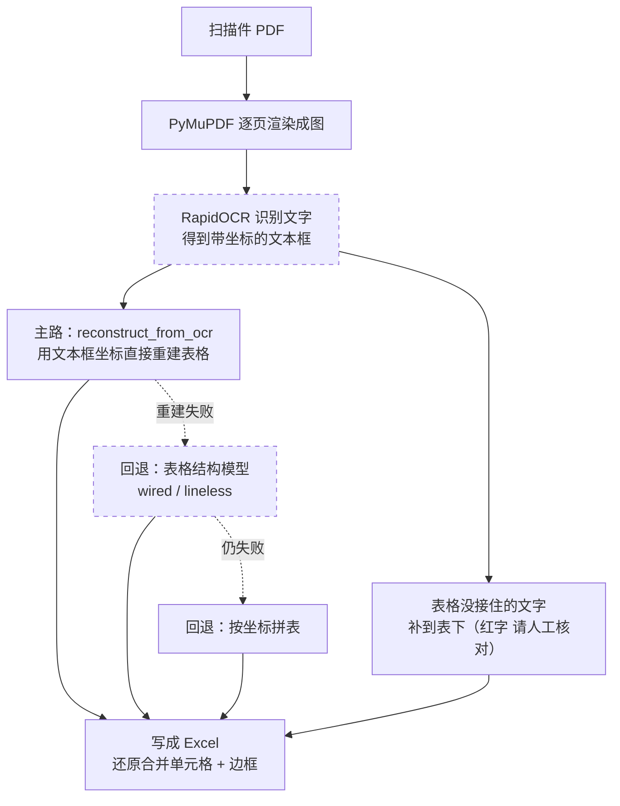

# audit-pdf2excel

> 不会写代码、没用过 GitHub 也没关系。你只要会在 VSCode 里跟 Cline（或其他 coding agent）说话，就能用起来。想快速看懂它能干什么，看这一页就够。

**把一堆扫描件 PDF（开户清单、报表这些）批量转成 Excel，一个 PDF 放一个工作表，并且尽量跟原件里表格长得一样（行列对齐、合并单元格、有边框），适合拿来做底稿。**

做审计、做底稿的时候，手上经常是一摞扫描件 PDF：银行开户清单、各种报表。要录进 Excel，只能一个个打开、看着抄、对齐行列，扫描件连复制粘贴都不行。量一大就又慢又容易错。

这个工具把这件事变成一句话：你把 PDF 放到一个文件夹，告诉 agent 跑一下，它自动把每个 PDF 识别、还原成表格，输出一个 `out.xlsx`。能识别出表格结构的页，会连合并单元格和边框一起还原，不是把字撒一地。识别没接住的零碎文字，会补在表格下面（红字标「请人工核对」），保证不丢内容。

## ⚠️ 关于准确性（务必先读）

**这个工具里没有生成式 AI（不是 ChatGPT 那种大模型），它不会「编」内容。** 里面只有两个本地跑的小识别模型（只负责「认」，不「编」），不联网上传你的文件。但也正因为有识别环节，结果会有不确定性，出错集中在两处：

- **OCR 认字**：RapidOCR 把图片上的字识别出来。扫描质量差时会认错字（比如 0/O、1/l、形近汉字），尤其是水印、倾斜、线条发虚的页。
- **表格归位**：哪个字属于哪个单元格，是靠坐标几何（回退时靠表格识别模型）推断的。复杂表、挤在一起的文字可能错列、串行。

所以：**转出来的 Excel 一律当「草稿」，必须对着原件核对再当底稿用。** 表格下面红字「请人工核对」区里的内容尤其要逐条过。工具已经尽量做到不丢字（没接住的都堆到表下），但「认得对不对、放得对不对」需要人来把关。

## 为什么比手工好

| | 手工 | 这个工具 |
|---|---|---|
| 多个 PDF 录入 | 一个个开、一个个转，重复劳动 | 一条命令批量跑，一个 PDF 一个工作表 |
| 扫描件 / 图片型 PDF | 不能直接复制，只能照着抄 | 自动 OCR 识别文字 |
| 表格格式 | 手动重排行列、合并单元格、画边框 | 自动还原行列、合并单元格、边框 |
| 怕漏内容 | 全靠人眼盯 | 没归进表格的文字自动补到表下，标「请人工核对」 |
| 耗时 | 一批几十分钟到几小时 | 几分钟跑完，人只做核对 |

## 给谁用

做审计、做财务底稿的人。手上一堆扫描件 PDF 要录进 Excel、还要保留表格样子，又不想一页页手敲。只要电脑上装了 VSCode 和 Cline 这类插件就能用，不需要会编程。

## 怎么用

> 前提：电脑上装好 VSCode 和 Cline（或 Cursor、Claude Code 这类 coding agent）。装过一次以后，以后每次都是跟 agent 说一句话的事。

**三步上手：**

1. **装** —— 拿到代码、装好依赖（见下面「装」，没 git 也能装）。
2. **放** —— 把要转的 PDF 放进任意一个文件夹。
3. **说** —— 告诉 agent：用 audit-pdf2excel 帮我把这个文件夹里的 PDF 转成 Excel。剩下的它自动跑完。

下面是更细的说明，平时不用全看。

### 装（第一次）

> 这一步只在第一次配置时做。下面给两条路，**没装 git 也能用**。

**方式一：下载 ZIP（不需要 git，最省事，推荐）**

1. 浏览器打开 https://github.com/hhaa134323/audit-pdf2excel
2. 点绿色的 **Code** 按钮 → **Download ZIP**
3. 解压到一个固定位置，比如 `D:\AgentProjects\audit-pdf2excel`
4. 然后装依赖（Windows）：

```bat
cd D:\AgentProjects\audit-pdf2excel
python -m venv .venv
.venv\Scripts\activate
pip install -r requirements.txt
```

或者更省事：把解压后的文件夹直接拖进 VSCode，对 Cline 说「帮我建虚拟环境并按 requirements.txt 装好依赖」，让它代劳后面几步。

**方式二：git clone（装了 git 的话）**

```bat
git clone https://github.com/hhaa134323/audit-pdf2excel.git
cd audit-pdf2excel
python -m venv .venv
.venv\Scripts\activate
pip install -r requirements.txt
```

> 报 `git 不是内部或外部命令` / `git: command not found`，就是没装 git。要么用上面的方式一下 ZIP，要么去 https://git-scm.com/download/win 装个 git 再重来。
> 同样，报 `python 不是内部或外部命令` 就是没装 Python，去 https://www.python.org/downloads/ 装，装的时候勾上「Add Python to PATH」。

**让 agent 装（推荐给不熟命令行的人）** —— 直接对 Cline 说：

> 从 https://github.com/hhaa134323/audit-pdf2excel 获取代码（如果没装 git，就直接下载 ZIP 解压，别卡在 git clone），然后帮我建一个虚拟环境并按 requirements.txt 装好依赖。

这样即使机器上没有 git，agent 也会改走下载 ZIP 的路，不会卡住。仓库里的 `AGENTS.md` / `.clinerules` 已经写好了环境约束和跑法，agent 会自动遵守。

### 放

把要转的 PDF 放进一个文件夹，比如 `D:\待转PDF`。单个文件也行。

### 说

装好之后，跟 agent 说清楚 PDF 在哪、想输出到哪就行：

> 用 audit-pdf2excel 帮我把 `D:\待转PDF` 里的 PDF 都转成 Excel，输出到 `D:\转出结果\out.xlsx`。

<details>
<summary>自己敲命令的参数说明（一般不用管，agent 会自动带）</summary>

```bat
# 单个文件
python pdf2excel.py -i 开户清单-test.pdf -o out.xlsx

# 整个文件夹（递归扫所有 PDF）
python pdf2excel.py -i D:\待转PDF -o D:\转出结果\out.xlsx

# 扫描件不清晰，调高分辨率
python pdf2excel.py -i 输入.pdf -o out.xlsx --dpi 400

# 排查列错位：导出每页 OCR 坐标和重建结果
python pdf2excel.py -i 输入.pdf -o out.xlsx --debug
```

- `-i` / `--input`：PDF 文件或目录。传目录时递归找下面所有 `*.pdf`。
- `-o` / `--output`：输出的 xlsx 路径，默认 `out.xlsx`。
- `--dpi`：渲染清晰度，默认 300。扫描件不清晰可调到 400（更慢）。
- `--min-score`：OCR 置信度阈值，默认 0.5。低于这个分的文字（多半是水印）不进表格，只放到表下兜底区。
- `--debug`：导出 `<输出>.debug.json`，里面是每页 OCR 的文字 + 坐标 + 重建结果。列错位时把这个文件发给写代码的人，照真实坐标调，不用瞎猜。

</details>

## 识别思路

虚线框是模型 / OCR 识别，实线框是脚本确定性执行：



1. PyMuPDF 把每页渲染成高清图。
2. RapidOCR 识别文字（纯 ONNX 识别模型，首次联网下模型，之后离线），得到一堆带坐标的文本框。
3. **主路 `reconstruct.py`：直接用 OCR 文本框坐标重建表格（纯几何，不用任何模型）。** 用「框最多」的那一行定表头和列边界，用最左列（序号）定逻辑行，每个文本框按中心点归到对应单元格。专门处理了两个扫描件难点：表头换行（「开户银」/「行名称」合回一列）、OCR 把同一横排跨多列的文字识别成一个超宽框（按字符切开归列，连续数字串如账号整段保留不拆断）。
4. 主路找不到明确表头时回退到表格结构识别模型（有线表 `wired_table_rec`、无线表 `lineless_table_rec`，同样是识别类模型，不生成内容）；再不行回退到纯坐标启发式拼表，保证不漏内容。对扫描件开户清单，一般主路就接住了，表格模型这层很少触发。
5. `table_to_excel.py` 把单元格写成 Excel，还原行列、合并单元格、边框。
6. 不丢内容：表格没接住的文字补在表格下面，标红「请人工核对」；低置信度文字（水印）不进表格，只进兜底区。

> 这里的「模型」指的是 OCR 和表格识别这类**识别型小模型**，不是 ChatGPT 那种生成式大模型。全程本地跑，不会把你的文件传到云端。

## 依赖（首次自动装）

都是 pip 可装的包，不需要装任何外部软件（不用 tesseract、poppler 这些），也不需要管理员权限。首次运行会自动下 OCR 和表格模型，需要联网；之后可以离线跑。

| 包 | 作用 |
|---|---|
| `pymupdf` | PDF 渲染成图 |
| `rapidocr-onnxruntime` | OCR 识别文字 |
| `wired-table-rec` / `lineless-table-rec` | 表格结构识别（回退方案用） |
| `beautifulsoup4` / `lxml` | 解析 HTML 表格 |
| `openpyxl` | 写 Excel |
| `numpy` | 坐标计算 |

## 仓库结构

```
audit-pdf2excel/
├── pdf2excel.py        主流程：渲染 -> OCR -> 重建 -> 写 Excel -> 兜底。CLI 入口
├── reconstruct.py      主路：纯几何重建表格（不依赖 OCR/模型，可单测）
├── table_to_excel.py   把单元格 / HTML 表格写成 Excel（合并单元格 + 边框）
├── tests/              单测（test_reconstruct.py，纯几何，不依赖 OCR）
├── requirements.txt    依赖清单
├── run.bat             Windows 一键跑（转 pdfs\ 文件夹）
├── AGENTS.md           给 coding agent 看的仓库规则
└── .clinerules         给 Cline 看的精简规则
```

跑 `--debug` 时会额外生成 `<输出>.debug.json`，里面是每页 OCR 坐标和重建结果，用来排查列错位。

## 局限

- OCR 准不准看扫描质量。倒歪、水印、薄线都会降低准确率。
- 扫描件没有可检测的表格线，列边界和跨列文字的拆分是几何近似，复杂或不规则的表格（尤其挤在一起的 CJK 名称）可能差一两个字，需要人工微调。
- 转出后请核对原件再当底稿用；表下红字「请人工核对」区的内容务必过一遍。
