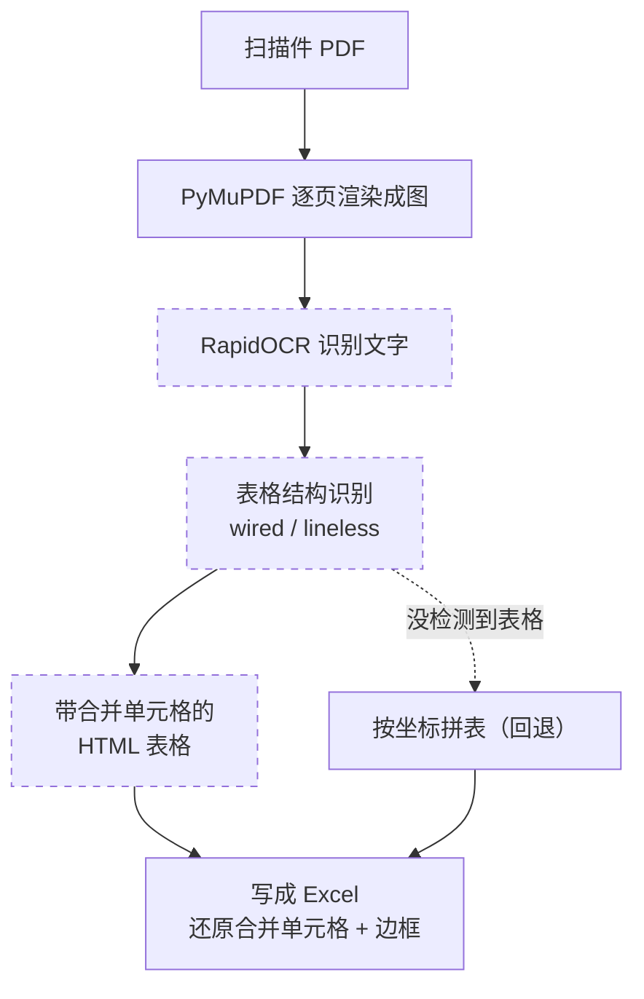

# audit-pdf2excel

> 不会写代码、没用过 GitHub 也没关系。你只要会在 VSCode 里跟 Cline（或其他 coding agent）说话，就能用起来。想快速看懂它能干什么，看这一页就够。

**把一堆扫描件 PDF（开户清单、报表这些）批量转成 Excel，一个 PDF 放一个工作表，并且尽量跟原件里表格长得一样（行列对齐、合并单元格、有边框），适合拿来做底稿。**

做审计、做底稿的时候，手上经常是一摆扫描件 PDF：银行开户清单、各种报表。要录进 Excel，只能一个个打开、看着抹、对齐行列，扫描件连复制粘贴都不行。量一大就又慢又容易错。

这个工具把这件事变成一句话：你把 PDF 放到一个文件夹，告诉 agent 跱一下，它自动把每个 PDF 识别、还原成表格，输出一个 `out.xlsx`。能识别出表格结构的页，会连合并单元格和边框一起还原，不是把字撒一地。

## 为什么比手工好

| | 手工 | 这个工具 |
|---|---|---|
| 多个 PDF 录入 | 一个个开、一个个转，重复劳动 | 一条命令批量跑，一个 PDF 一个工作表 |
| 扫描件 / 图片型 PDF | 不能直接复制，只能照着抹 | 自动 OCR 识别文字 |
| 表格格式 | 手动重排行列、合并单元格、画边框 | 自动识别表格结构，还原合并单元格和边框 |
| 耗时 | 一批几十分钟到几小时 | 几分钟跑完，人只做核对 |

## 给谁用

做审计、做财务底稿的人。手上一堆扫描件 PDF 要录进 Excel、还要保留表格样子，又不想一页页手敲。只要电脑上装了 VSCode 和 Cline 这类插件就能用，不需要会编程。

## 怎么用

> 前提：电脑上装好 VSCode 和 Cline（或 Cursor、Claude Code 这类 coding agent）。装过一次以后，以后每次都是跟 agent 说一句话的事。

**三步上手：**

1. **装** —— 跟 agent 说一句，让它把 https://github.com/hhaa134323/audit-pdf2excel 克隆下来，并装好依赖。
2. **放** —— 把要转的 PDF 放进任意一个文件夹。
3. **说** —— 告诉 agent：用 audit-pdf2excel 帮我把这个文件夹里的 PDF 转成 Excel。剩下的它自动跑完。

下面是更细的说明，平时不用全看。

### 装（第一次）

**用 agent 装（推荐）** —— 直接对 Cline 说：

> 把 https://github.com/hhaa134323/audit-pdf2excel 克隆到本地，帮我建一个虚拟环境并按 requirements.txt 装好依赖。

agent 会自己跑 `git clone` 和 `pip install`。仓库里的 `AGENTS.md` / `.clinerules` 已经写好了环境约束和跑法，agent 会自动遵守。

**自己装（会命令行的话）** —— Windows 下：

```bat
git clone https://github.com/hhaa134323/audit-pdf2excel.git
cd audit-pdf2excel
python -m venv .venv
.venv\Scripts\activate
pip install -r requirements.txt
```

### 放

把要转的 PDF 放进一个文件夹，比如 `D:\待转PDF`。单个文件也行。

### 说

装好之后，跟 agent 说清楚 PDF 在哪、想输出到哪就行：

> 用 audit-pdf2excel 帮我把 `D:\待转PDF` 里的 PDF 都转成 Excel，输出到 `D:\转出结果\out.xlsx`。

<details>
<summary>自己敲命令的参数说明（一般不用管，agent 会自动带）</summary>

```bat
# 单个文件
python pdf2excel.py -i 开户清单-test.pdf -o out.xlsx

# 整个文件夹（递归扫所有 PDF）
python pdf2excel.py -i D:\待转PDF -o D:\转出结果\out.xlsx
```

- `-i` / `--input`：PDF 文件或目录。传目录时递归找下面所有 `*.pdf`。
- `-o` / `--output`：输出的 xlsx 路径，默认 `out.xlsx`。
- `--dpi`：渲染清晰度，默认 300。扫描件不清晰可调到 400。

</details>

## 识别思路

虚线框是模型识别，实线框是脚本确定性执行：



1. PyMuPDF 把每页渲染成高清图。
2. RapidOCR 识别文字（纯 ONNX，首次联网下模型，之后离线）。
3. 表格结构识别：有线表用 `wired_table_rec`，无线表用 `lineless_table_rec`，把 OCR 结果拼成带合并单元格的 HTML 表格。
4. 把 HTML 表格写成 Excel，还原行列、合并单元格、边框。
5. 某页没检测到表格（比如快递面单这种无线文本）就回退到按坐标拼表，保证不漏内容。

## 依赖（首次自动装）

都是 pip 可装的包，不需要装任何外部软件（不用 tesseract、poppler这些），也不需要管理员权限。首次运行会自动下 OCR 和表格模型，需要联网；之后可以离线跑。

| 包 | 作用 |
|---|---|
| `pymupdf` | PDF 渲染成图 |
| `rapidocr-onnxruntime` | OCR 识别文字 |
| `wired-table-rec` / `lineless-table-rec` | 表格结构识别 |
| `beautifulsoup4` / `lxml` | 解析 HTML 表格 |
| `openpyxl` | 写 Excel |

## 仓库结构

```
audit-pdf2excel/
├── pdf2excel.py        主流程：渲染 -> OCR -> 表格识别 -> 写 Excel（带坐标拼表回退）
├── table_to_excel.py   把带合并单元格的 HTML 表格写成 Excel（合并 + 边框）
├── tests/              单测（HTML 解析、坐标拼表）
├── requirements.txt    依赖清单
├── run.bat             Windows 一键跑
├── AGENTS.md           给 coding agent 看的仓库规则
└── .clinerules         给 Cline 看的精简规则
```

## 局限

- OCR 准不准看扫描质量。倒歪、水印、薄线都会降低准确率。
- 表格结构识别不是 100% 准，复杂或不规则的表格可能要人工微调。
- 转出后请核对原件再当底稿用。
